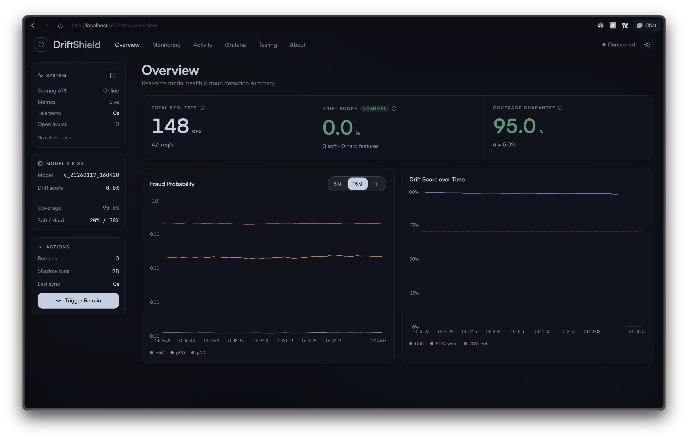
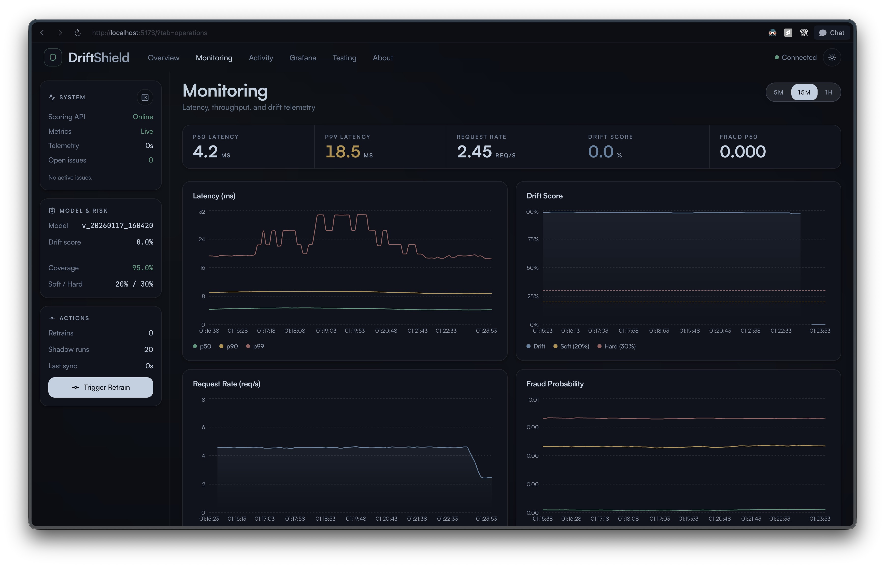
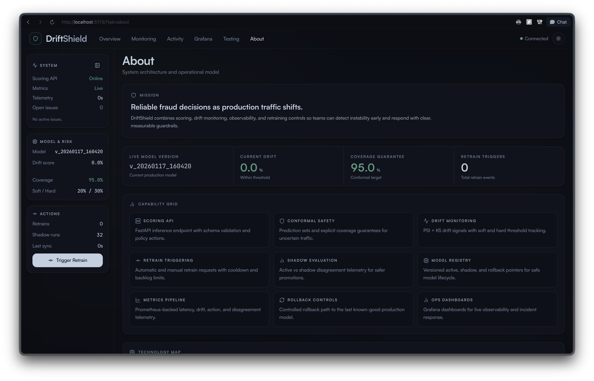

# Drift Shield

Fraud detection API with real-time drift monitoring, uncertainty-aware predictions, and retrain orchestration.

## Features

- Scores transactions with an XGBoost model
- Detects drift using PSI + KS signals
- Uses conformal prediction sets for uncertainty-aware decisions
- Emits retrain requests when drift thresholds are breached
- Serves a React dashboard and Prometheus metrics

## Screenshots

<div align="center">
  
  
  
</div>

## Quickstart (Docker)

The fastest way to run the full stack (API + Dashboard + Monitoring):

```bash
docker compose --profile monitoring up --build
```

**Services:**
- **Frontend:** http://localhost:5173
- **API Docs:** http://localhost:8000/docs
- **Grafana:** http://localhost:3000/d/afe3285cd4xkwc/drift-shield (user/pass: `admin`/`admin`)
- **Prometheus:** http://localhost:9090

> **Note:** The API container will bootstrap an initial model on startup. If you want to use your own data, place `creditcard.csv` in `data/raw/` before starting.

## Local Development

If you prefer to run services manually:

1. **Install Dependencies**
   ```bash
   pip install -r requirements.txt
   cd frontend_new && bun install
   ```

2. **Start the Stack**
   ```bash
   ./dev.sh
   ```

## Stack

| Layer | Tech |
|---|---|
| API | FastAPI + Uvicorn |
| Model | XGBoost + scikit-learn |
| Drift | PSI + KS test |
| Uncertainty | Conformal prediction |
| Frontend | React + Vite + Tailwind (`frontend_new/`) |
| Metrics | Prometheus (+ optional Grafana) |

## Core API Endpoints

- `GET /health`
- `POST /predict`
- `GET /dashboard/stats`
- `POST /retrain`
- `GET /models/info`
- `GET /prometheus/{path}`

## Docker Details

Start API + watcher + frontend + Prometheus + IEEE traffic:

```bash
docker compose up --build
```

The `ieee_traffic` service:
- prepares `data/processed/ieee_adapted.csv` from `ieee-fraud-detection/train_transaction.csv` (if provided)
- continuously sends traffic to `POST /predict` so charts stay populated

## Dashboard Data Notes

- If values are empty, ensure request traffic is flowing.
- In Docker, check `driftshield_ieee_traffic` container status.

## Project Structure

```text
src/fraud_service/     Backend package
scripts/               Training, retrain, and utility scripts
frontend_new/          Active React dashboard
ieee-fraud-detection/  IEEE-CIS source files for demo traffic
monitoring/            Prometheus and Grafana configs
config.yaml            Runtime settings
compose.yml            Docker Compose stack
```
